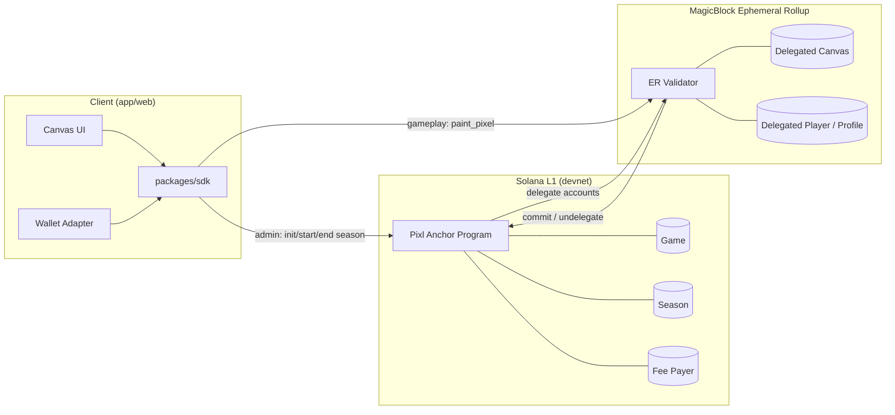
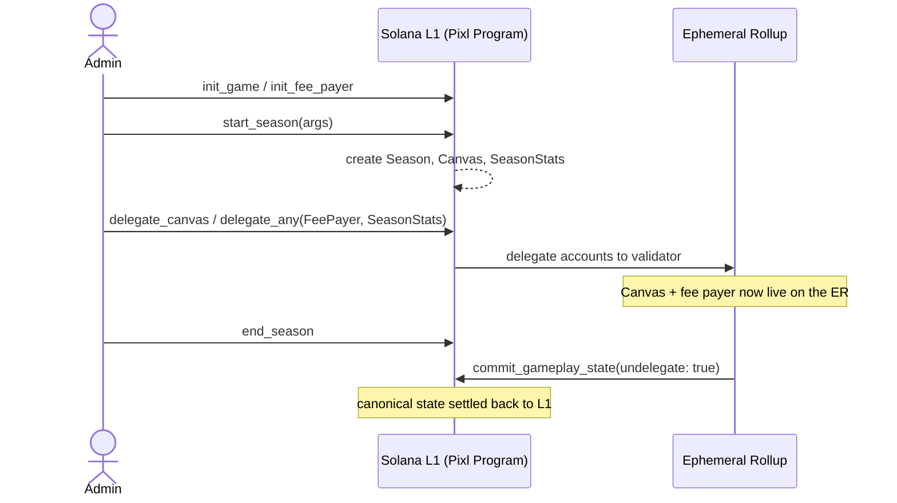
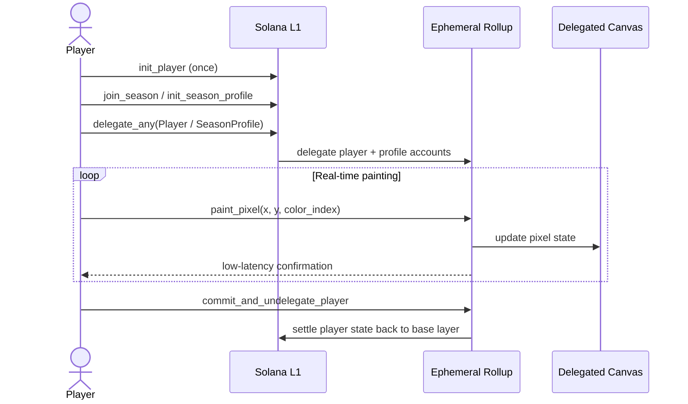
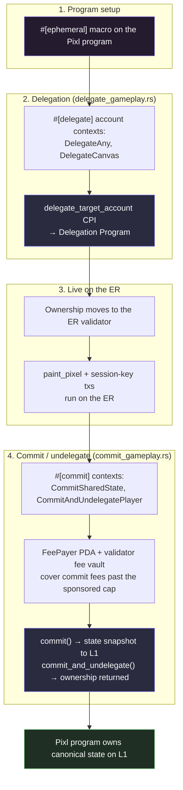

# Architecture

Diagrams describing Pixl's system architecture, request flow, and MagicBlock integration.

## System overview

## Season lifecycle

## Player gameplay flow

## MagicBlock integration points

Key accounts delegated to the Ephemeral Rollup: `Canvas`, `Player`, `SeasonProfile`, `SeasonStats`, and the shared `FeePayer`. Delegation and undelegation are handled by `programs/pixl/src/instructions/delegate_gameplay.rs` and `commit_gameplay.rs`, using the `ephemeral-rollups-sdk` Anchor macros (`#[ephemeral]`, `#[delegate]`, `#[commit]`).

Two other integration surfaces sit outside the program:

- **Session keys** (`packages/sdk`, used by `app/web/lib/usePainting.ts`'s `paintWithSession`): players sign a short-lived session key once, then `paint_pixel` calls on the ER are authorized without a wallet popup per pixel.
- **ER-first reads with L1 fallback** (`app/web/lib/useLeaderboard.ts`): the leaderboard and canvas state are read from the ER connection first; if that read fails, the client falls back to the last-committed state on L1 so the UI stays usable across delegation/undelegation windows.
